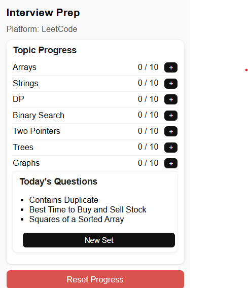
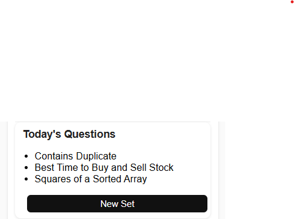

# 🧠 Smart Interview Prep – Chrome Extension (Manifest V3)

A Chrome Extension designed to help you **track DSA progress**, stay **consistent**, and view **daily interview questions** while practicing on **LeetCode** and **GeeksforGeeks**.

---

# ━━━━━━━━━━━━━━━━━━━━━━━━━━━━━━━━━━━━━━━━

# 📸 Screenshots


```
📁 images/
    ├── popup.png
    └── daily.png
```

| Popup UI              | Daily Questions       |
| --------------------- | --------------------- |
|  |  |

---

# ━━━━━━━━━━━━━━━━━━━━━━━━━━━━━━━━━━━━━━━━

# 🚀 Features

### ✔ Platform Detection

Detects whether the user is on **LeetCode** or **GeeksforGeeks** in real time.

---

### ✔ Track Progress for 7 DSA Topics

Each topic has:

* A counter (**0–10**)
* A + button
* Persistent storage

**Topics Included:**

* Arrays
* Strings
* Dynamic Programming
* Binary Search
* Two Pointers
* Trees
* Graphs

---

### ✔ Daily Questions Generator

Generates **3 random DSA questions** every day.
Includes a **New Set** button to refresh the list.

---

### ✔ Persistent Storage

Saved using:

```
chrome.storage.local
```

Survives:

* Browser restart
* OS shutdown
* Chrome refresh

---

### ✔ Reset System

Resets all DSA topic counters instantly.

---

# ━━━━━━━━━━━━━━━━━━━━━━━━━━━━━━━━━━━━━━━━

# 🛠️ Tech Stack

* **Manifest V3**
* **JavaScript**
* **HTML**
* **CSS**
* **Chrome Storage API**
* **Chrome Tabs API**

---

# ━━━━━━━━━━━━━━━━━━━━━━━━━━━━━━━━━━━━━━━━

# 📁 Project Structure

```
smart-interview-prep-extension/
│
├── manifest.json
├── popup.html
├── popup.js
├── style.css
├── icons/
└── images/
```

---

# ━━━━━━━━━━━━━━━━━━━━━━━━━━━━━━━━━━━━━━━━

# 📦 Installation (Developer Mode)

1. Download or clone this repository
2. Open **chrome://extensions**
3. Enable **Developer Mode**
4. Click **Load Unpacked**
5. Select the project folder
6. The extension will appear in your Chrome toolbar

---

# ━━━━━━━━━━━━━━━━━━━━━━━━━━━━━━━━━━━━━━━━

# 🎯 Usage

* Open LeetCode or GFG
* Click the extension icon
* Track progress using the + buttons
* View **Today’s Questions**
* Reset anytime to start fresh

---

# ━━━━━━━━━━━━━━━━━━━━━━━━━━━━━━━━━━━━━━━━

# 🔮 Future Enhancements

* Progress Bars
* Streak System
* Notes for each topic
* Dark Mode
* LeetCode submission detection
* Export / Import progress

---

# ━━━━━━━━━━━━━━━━━━━━━━━━━━━━━━━━━━━━━━━━

# 📄 License

This project is licensed under the **MIT License**.

---

# ━━━━━━━━━━━━━━━━━━━━━━━━━━━━━━━━━━━━━━━━

# 👤 Author

**Anuranjan SB**
🔗 GitHub: [https://github.com/anuranjansb](https://github.com/anuranjansb)
🔗 LinkedIn: [https://www.linkedin.com/in/anuranjan-sb-5b2500255/](https://www.linkedin.com/in/anuranjan-sb-5b2500255/)

---
